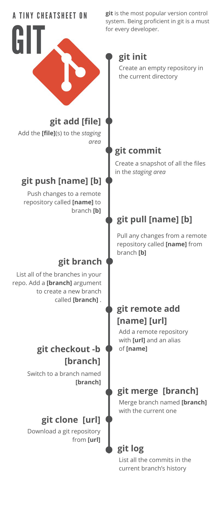
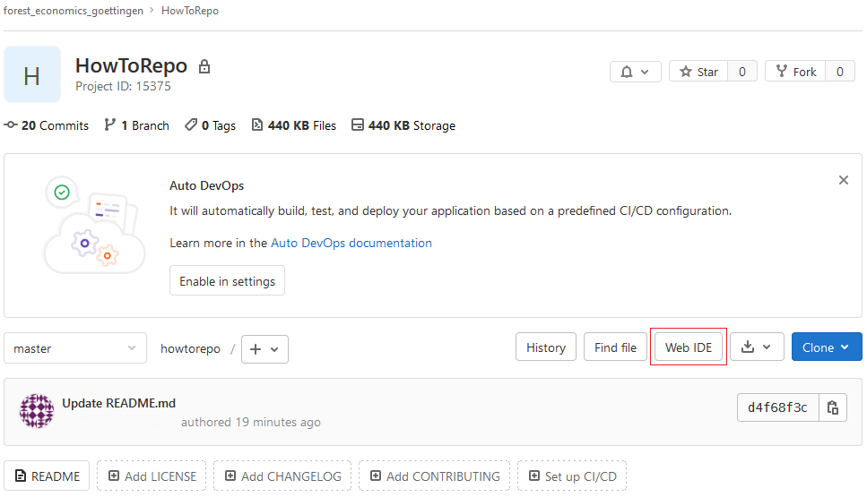
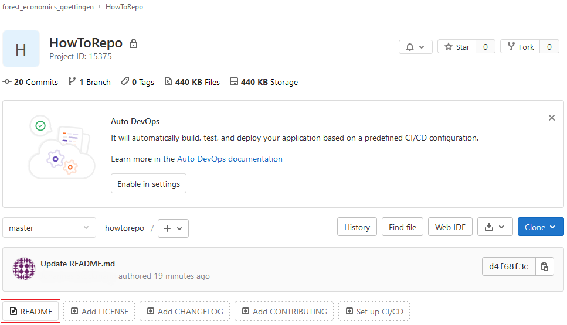

Leitfaden zur Archivierung forstökonomischer Inhalte
-------------------------------------------

Dieses Verzeichnis ("Repository*") soll Studierenden, MitarbeiterInnen der Abteilungen Forstökonomie und Forstökonomie und nachhaltige Landnutzungsplanung sowie ForschungspartnerInnen einen Leitfaden für die Archivierung von Inhalten in GitLab geben.
GitLab basiert auf dem Open-Source Versionskontrollsystem *Git*, welches für die Entwicklung und Bearbeitung von Projekten erstellt wurde. Neben der Versionsverwaltung von beispielsweise R-Skriptenn, bietet GitLab zusätzlich Management-, Bug-Tracking- sowie Wiki-Funktionalitäten an. Weiterhin lassen sich bei der Zusammenarbeit mit mehreren Personen Überprüfungen von Änderungen über sogenannte „Merge Requests“ durchführen. 

Dieser Leitfaden widmet sich neben der Erläuiterung der Basisfunktionalitäten in erster Linie den folgenden Punkten:

<ul>
<li>
<a href="#1. Erste Schritte in Git">1. Erste Schritte in Git</a>
</li>
<li>
<a href="#2. Erstellung eines Projektes in GitLab">2. Erstellung eines Projektes in GitLab</a>
</li>
<li>
<a href="#3. Grundstruktur der README-Datei">2. Grundstruktur der README-Datei</a>
</li>
</ul>

<h3>
<a name="1. Erste Schritte in Git">1. Erste Schritte in Git</a>
</h3>

Um im Rahmen der Versionsverwaltung Inhalte von einer Weboberfläche (hier: GitLab) zu beziehen oder lokale Inhalte auf einer Weboberfläche zugänglich zu machen, muss an erster Stelle *Git* installiert werden. In den folgenden Links befinden sich eine [Installationsanleitung](https://git-scm.com/book/de/v2/Erste-Schritte-Git-installieren) sowie die Installationsdateien für die Betriebssysteme

- [Linux/Unix](http://git-scm.com/download/linux)

- [macOS](http://git-scm.com/download/mac)

- [Windows](https://git-scm.com/download/win)

Ist Git auf dem Rechner installiert, kann ein spezifisches Projekt aus GitLab als lokale Kopie ("*clone*") gespeichert werden, um diese zu bearbeiten. Lokale Änderungen können im Anschluss wieder zentral aif GitLab hochgeladen ("*push*") werden. Des Weiteren kann die lokale Kopie durch einen erneuten ("*pull*") von der Weboberfläche um mögliche Änderungen durch andere ergänzt und auf den "neusten Stand" gebracht werden. Die folgende Abbildung stellt eine Übersicht der wichtigsten Git-Befehle dar.

Eine Bearbeitung von Textdateien (z.B. R-Code oder Markdown) eines Projektes kann allerdings auch direkt auf der Weboberfläche im jeweiligen Repository über den "Web IDE"-Botton vorgenommen werden. 

Nicht möglich ist dies für Binärdateien, wie beispielsweise Excel-Tabellenblätter.

<h3>
<a name="2. Erstellung eines Projektes in GitLab">2. Erstellung eines Projektes in GitLab</a>
</h3>

<h3>
<a name="3. Grundstruktur der README-Datei">3. Grundstruktur der README-Datei</a>
</h3>

Die README-Datei eines Projektes In GitLab gibt eine kurze Übersicht über den Inhalt des Repositorys und ist üblicherweise in Markdown geschrieben, sodass der Inhalt der Datei direkt gerendert und im unteren Verlauf der Repository dargestellt werden kann. Markdown ist eine vereinfachte Auszeichnungssprache, die ohne weitere Konvertierung leicht lesbar ist. Markdown-Dateien können beispielsweise mit R-Studio oder direkt in GitLab über den "README" bzw. "Add README"-Button erstellt werden.

#### Aufbau und Struktur des Repositorys

- Installation von git
- Repository erstellen
- Repository klonen

#### Aufbau der README-Datei

- kurzer Einstieg in Markdown & Cheatsheet

Jedes Repository 
