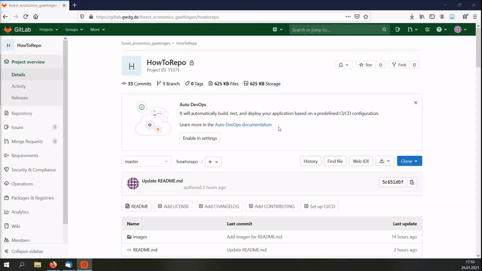

Leitfaden zur Archivierung forstökonomischer Inhalte
-------------------------------------------

Dieses Verzeichnis ("*repository*") soll Studierenden, MitarbeiterInnen der Abteilungen Forstökonomie und Forstökonomie und nachhaltige Landnutzungsplanung sowie ForschungspartnerInnen einen Leitfaden für die Archivierung von Inhalten in GitLab geben.
GitLab basiert auf dem Open-Source Versionskontrollsystem *Git*, welches für die Entwicklung und Bearbeitung von Projekten erstellt wurde. Neben der Versionsverwaltung von beispielsweise R-Skripten, bietet GitLab zusätzlich Management-, Bug-Tracking- sowie Wiki-Funktionalitäten an. Weiterhin lassen sich bei der Zusammenarbeit mit mehreren Personen Überprüfungen von Änderungen über sogenannte "*merge requests*" durchführen. 

Dieser Leitfaden widmet sich neben der Erläuterung der Basisfunktionalitäten weiterhin den folgenden Punkten:

<ul>
<li>
<a href="#1. Erste Schritte in Git">1. Erste Schritte in Git</a>
</li>
<li>
<a href="#2. Erstellung eines Projektes in GitLab">2. Erstellung eines Projektes in GitLab</a>
</li>
<li>
<a href="#3. Upload und Bearbeitung von Inhalten">3. Upload und Bearbeitung von Inhalten</a>
</li>
<li>
<a href="#4. Grundstruktur der README-Datei">2. Grundstruktur der README-Datei</a>
</li>
</ul>

<h3>
<a name="1. Erste Schritte in Git">1. Erste Schritte in Git</a>
</h3>

Um im Rahmen der Versionsverwaltung Inhalte von einer Weboberfläche (hier: GitLab) zu beziehen oder lokale Inhalte auf einer Weboberfläche zugänglich zu machen, muss an erster Stelle *Git* installiert werden. In den folgenden Links befinden sich eine [Installationsanleitung](https://git-scm.com/book/de/v2/Erste-Schritte-Git-installieren) sowie die Installationsdateien für die Betriebssysteme

- [Linux/Unix](http://git-scm.com/download/linux)

- [macOS](http://git-scm.com/download/mac)

- [Windows](https://git-scm.com/download/win)

Ist *Git* auf dem Rechner installiert, kann ein spezifisches Projekt aus GitLab als lokale Kopie (*clone*) gespeichert werden, um dieses zu bearbeiten. Lokale Änderungen können im Anschluss wieder zentral auf GitLab hochgeladen (*push*) werden. Des Weiteren kann die lokale Kopie durch einen (*pull*) von der Weboberfläche um mögliche Änderungen durch andere ergänzt und auf den "neusten Stand" gebracht werden. Die folgende Abbildung stellt eine kurze Übersicht der wichtigsten Git-Befehle dar.


<h3>
<a name="2. Erstellung eines Projektes in GitLab">2. Erstellung eines Projektes in GitLab</a>
</h3>

Die Erstellung eines neuen Projektes über die Weboberfläche in GitLab wird in der folgenden Animation dargestellt. 



Bei der Benennung des Projektnamen ist darauf zu achten, alphanumerische Zeichen (a-z, A-Z, 0-9) sowie  als Sondferzeichen einen Unterstrich(_) zu verwenden. Umlaute sowie Leerzeichen sollten vermieden werden.  


<h3>
<a href="#3. Upload und Bearbeitung von Inhalten">3. Upload und Bearbeitung von Inhalten</a>
</h3>

Nach der Initialisierung des Repositorys kann dieses als neues Verzeichnis auf den eigenen Rechner erstellt werden, um darüber den Upload der gewünschten Inhalte zu ermöglichen. Über die Konsole des jeweiligen Betriebssystems wird zu diesem Zweck der Befehl

```
git clone https://gitlab.gwdg.de/forest_economics_goettingen/howtorepo.git
```
ausgeführt. Die jeweilige URL kann über den blauen <strong>Clone</strong>-Button als HTTPS-Link (alternativ: SSH) kopiert und in der Kommandozeile eingefügt werden. Zu beachten ist dabei der Zielort(!), an dem die Kopie des Repository erstellt werden soll. Liegt das gewünschte Verzeichnis als lokale Kopie vor, können die benötigten Dateien in den Ordner (in diesem Fall: howtorepo) eingefügt werden. Falls in der anzufertigenden *README*-Datei (siehe Kapitel 4) Abbildungen (z.B. als PNG-Datei) dargestellt werden sollen, können diese in einem Ordner mit dem Namen "images" abgelegt werden, welcher ebenso in den Ordner "howtorepo" eingefügt wird. Für die Benennung von Dateien sowie Bildern gilt ebenso die Verwendung alphanumerischer Zeichen. 

Um die Änderungen in einem lokalen Arbeitsverzeichnis (*working directory*) in GitLab zu speichern, müssen zwei "Instanzen" überwunden werden. 


*Quelle:https://rogerdudler.github.io/git-guide/index.de.html*

In einem ersten Schritt werden die Dateien in einen Index (*staging area*) überführt. Hier kann noch einmal darüber darüber entschieden werden, welche Änderungen tatsächlich vorgenommen und welche vielleicht doch noch verworfen werden sollen. Mit dem Befehle 

```
git add *
```
werden alle Änderungen im Verzeichnis zum Index hinzugefügt. Um den Status des Workflows zu überprüfen, führen man den Befehl 

```
git status
```
aus, welcher hier beispielshaft die folgende Antwort liefert:

```
On branch master

No commits yet

Changes to be committed:
  (use "git rm --cached <file>..." to unstage)
        new file:   howtorepo_code_20200128.R
        new file:   images/repo.PNG


```
Diese Antwort liefert die Information, dass im Hauptentwicklungspfad (*branch master*) noch keine Änderungen für den Upload vorgemerkt sind (*No commits yet*), jedoch Änderungen im Index durch zwei neue Dateien entstanden sind, welche zum einen ein R-Skript (howtorepo_code_20200128.R) und zum anderen ein Foto ("repo.PNG") im Ordner "images" sind.   

In einer zweiten Instanz werden diese Änderungen bestätigt. Zusätzlich werden die Änderungen mit einer Nachricht versehen, welche über den Inhalt der Änderung eine Auskunft geben soll. 

```
git commit -m "Add images for README & R-Code"

```
Zuletzt müssen die Änderungen unter Verwendung des Befehls 

```
git push origin master

```
Auf diese Weise werden die Änderungen an das entfernte Repository in GitLab gesendet und im Hauptentwicklungspfad eingefügt. Ist der Upload erfolgt, können Änderungen in Textdateinen (z.B. R-Skripte oder Markdown) auch direkt in GitLab über den "<strong>Web IDE</strong>"-Botton vorgenommen werden. Nicht möglich ist dies für Binärdateien, wie beispielsweise Excel-Tabellenblätter.


<h3>
<a name="4. Grundstruktur der README-Datei">4. Grundstruktur der README-Datei</a>
</h3>

Die README-Datei eines Projektes In GitLab gibt eine kurze Übersicht über den Inhalt des Repositorys und ist üblicherweise in Markdown geschrieben, sodass der Inhalt der Datei direkt gerendert und im unteren Verlauf der Repository dargestellt werden kann. Markdown ist eine vereinfachte Auszeichnungssprache, die ohne weitere Konvertierung leicht lesbar ist. Markdown-Dateien können beispielsweise mit R-Studio oder direkt in GitLab über den "<strong>README</strong>" bzw. "<strong>Add README</strong>"-Button erstellt werden.

- cheatcheat markdown


Für zukünftige Archivierungsarbeiten soll die "<strong>README_blank.md</strong>" als Vorlage dienen, welche in diesem Repository zur Verfügung steht. Eine fertige README-Datei soll folgende Bestandteile aufweisen:

- <strong>Überschrift:</strong> Name des Forschungsarbeit / Modellname und Namen der AutorInnen
- <strong>Kurzbeschreibung:</strong> Erläuterung des Inhaltes; welche Inputs werden benötigt/genutzt, welchen Output gibt es, welchen Nutzen kann der Anwendende daraus ziehen?
- <strong>Inhaltsverzeichnis:</strong> 
    + <strong>1. Einleitung:</strong> Entstehung der Forschungsarbeit/ des Modells; geschichtlicher Hintergrund; warum wurde das Modell entwickelt?
    + <strong>2. Grundlegende Theorie:</strong> Methodischer Hintergrund; welche Formeln oder Ansätze wurden genutzt?
    + <strong>3. Aufbau des Modells:</strong> Welche Parameter oder Variablen werden als Input genutzt, welche Variablen stellen den Output dar? Bitte die genauen Variablennnamen verwenden, welche auch im Code verwendet werden.
    + <strong>4. Aufbau des Modells:</strong> Schematische Darstellung des Modells und seiner Bestandteile (optional) 
    + <strong>5. Hinweise zur Anwendung:</strong> Werden unübliche Einheiten genutzt? Müssen gewisse Restriktionen berücksichtigt werden (z.B. Extrapolationsbereiche)?
    + <strong>6. Beispielhafte Anwendung:</strong> Beispielaufgabe mit einer genauen Beschreibung über die einzelnen Anwendungsschritte (z.B. R-Packages die geladen werden, Import von Datensätzen, unterschiedliche Rechenschritte,...)
    + <strong>7. Literatur:</strong> Literatur, auf welche in der RAEDME verwiesen wird (z.B. Quellen für theoretische Hintergünde)
    + <strong>8. Zitationshinweis</strong> Veröffentlichungen, welche bei Anwendung der Inhalte zitiert werden können 

